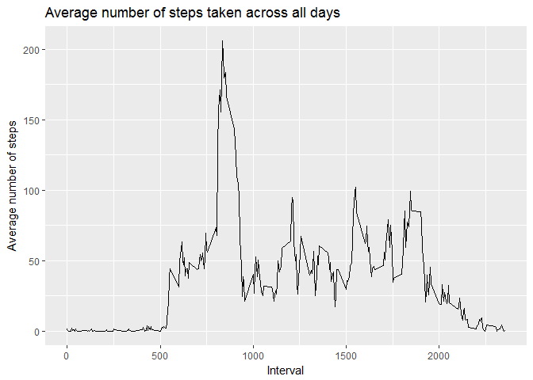
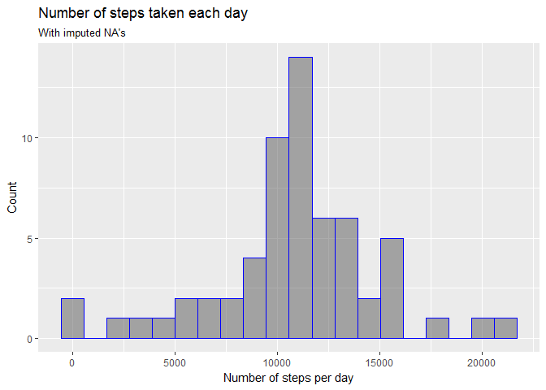

 
### **Coursera: Reproducible Research: Course Project 1**
Details about this course can be found [here](https://www.coursera.org/learn/reproducible-research). The author of this
unremarkable markdown is [Sebastian Kraus](https://www.linkedin.com/in/sebastiankrausjena/) and it's his first one. Feedback is highly appreciated :).

## Loading and preprocessing the data


```r
#url <- "https://d396qusza40orc.cloudfront.net/repdata%2Fdata%2Factivity.zip"
#download.file(url, destfile = "activity.zip", method = "auto")
unzip("activity.zip", exdir = "data")
dta <- read.csv("./data/activity.csv")
```


```r
library(tidyverse)

dta.n <- mutate(dta, date = as.Date(dta$date))
dta.n <- filter(dta.n, steps != "NA")

head(dta.n)
```

```
##   steps       date interval
## 1     0 2012-10-02        0
## 2     0 2012-10-02        5
## 3     0 2012-10-02       10
## 4     0 2012-10-02       15
## 5     0 2012-10-02       20
## 6     0 2012-10-02       25
```

```r
tail(dta.n)
```

```
##       steps       date interval
## 15259     0 2012-11-29     2330
## 15260     0 2012-11-29     2335
## 15261     0 2012-11-29     2340
## 15262     0 2012-11-29     2345
## 15263     0 2012-11-29     2350
## 15264     0 2012-11-29     2355
```

```r
str(dta.n)
```

```
## 'data.frame':	15264 obs. of  3 variables:
##  $ steps   : int  0 0 0 0 0 0 0 0 0 0 ...
##  $ date    : Date, format: "2012-10-02" "2012-10-02" ...
##  $ interval: int  0 5 10 15 20 25 30 35 40 45 ...
```

## What is mean total number of steps taken per day?


```r
dta.n.by.day <- group_by(dta.n, date)
st.p.day <- summarise(dta.n.by.day, sum_steps = sum(steps))
st.p.day
```

```
## # A tibble: 53 × 2
##          date sum_steps
##        <date>     <int>
## 1  2012-10-02       126
## 2  2012-10-03     11352
## 3  2012-10-04     12116
## 4  2012-10-05     13294
## 5  2012-10-06     15420
## 6  2012-10-07     11015
## 7  2012-10-09     12811
## 8  2012-10-10      9900
## 9  2012-10-11     10304
## 10 2012-10-12     17382
## # ... with 43 more rows
```


```r
ggplot(data = st.p.day) +
        geom_histogram(mapping = aes(x = sum_steps),bins = 20, col = "blue",
                       alpha = 0.5) + 
        labs(title="Number of steps taken each day",
             x="Number of steps per day", y="Count")
```

<!-- -->


```r
mean(st.p.day$sum_steps)
```

```
## [1] 10766.19
```

```r
median(st.p.day$sum_steps)
```

```
## [1] 10765
```


The total numbers of steps per day have a mean of 10766 and a median of 10765.


## What is the average daily activity pattern?


```r
mean.st.p.int <- summarise(group_by(dta.n, interval), 
                          mean_steps = mean(steps))

ggplot(data = mean.st.p.int) +
        geom_line(mapping = aes(x = interval, y = mean_steps)) +
        labs(title="Average number of steps taken across all days",
             x="Interval", y="Average number of steps")
```

<!-- -->


```r
mean.st.p.int[which.max(mean.st.p.int$mean_steps),]
```

```
## # A tibble: 1 × 2
##   interval mean_steps
##      <int>      <dbl>
## 1      835   206.1698
```


The 5-minutes interval at 835, on average across all the days in the dataset, contains the maximum number of 206 steps.


## Imputing missing values


```r
nrow(dta[which(is.na(dta)==TRUE),])
```

```
## [1] 2304
```


2304 values are missing.


```r
m.st.p.int <- summarise(group_by(dta,interval), 
                        mean_steps = mean(steps, na.rm = TRUE))
```

The NA's for the steps will be replaced by their mean for the corresponding interval.


```r
dta.sim <- dta

for(r in 1:nrow(dta.sim)){
        if (is.na(dta.sim$steps[r])) {
                st.all <- m.st.p.int$mean_steps[
                        m.st.p.int$interval == dta.sim$interval[r]];
                dta.sim$steps[r] <- st.all}}

summary(dta.sim)
```

```
##      steps                date          interval     
##  Min.   :  0.00   2012-10-01:  288   Min.   :   0.0  
##  1st Qu.:  0.00   2012-10-02:  288   1st Qu.: 588.8  
##  Median :  0.00   2012-10-03:  288   Median :1177.5  
##  Mean   : 37.38   2012-10-04:  288   Mean   :1177.5  
##  3rd Qu.: 27.00   2012-10-05:  288   3rd Qu.:1766.2  
##  Max.   :806.00   2012-10-06:  288   Max.   :2355.0  
##                   (Other)   :15840
```

```r
str(dta.sim)
```

```
## 'data.frame':	17568 obs. of  3 variables:
##  $ steps   : num  1.717 0.3396 0.1321 0.1509 0.0755 ...
##  $ date    : Factor w/ 61 levels "2012-10-01","2012-10-02",..: 1 1 1 1 1 1 1 1 1 1 ...
##  $ interval: int  0 5 10 15 20 25 30 35 40 45 ...
```


```r
dta.by.date.sim <- group_by(dta.sim, date)

st.p.day.sim <- summarise(group_by(dta.sim, date), sum_steps = sum(steps))

ggplot(data = st.p.day.sim) +
        geom_histogram(mapping = aes(x = sum_steps), bins = 20,
                       col = "blue", alpha = 0.5) +
        labs(title="Number of steps taken each day", subtitle="With imputed NA's",
             x="Number of steps per day", y="Count")
```

<!-- -->


```r
# Mean and Median with replaced NA's
mean(st.p.day.sim$sum_steps); median(st.p.day.sim$sum_steps)
```

```
## [1] 10766.19
```

```
## [1] 10766.19
```

Both mean and median are equal with 10766.19 steps after replacing the NA's.


```r
# Mean and Median without NA's
mean(st.p.day$sum_steps); median(st.p.day$sum_steps)
```

```
## [1] 10766.19
```

```
## [1] 10765
```

There is a small difference of 1.19 steps for the data without NA's. Here the mean is 10766.19 and the median is 10765.00.


## Are there differences in activity patterns between weekdays and weekends?

```r
dta.sim$date <- as.Date(dta.sim$date)
dta.sim <- mutate(dta.sim, wd = weekdays(date))
dta.sim <- dta.sim %>%
        mutate(wd.we = as.factor(ifelse(wd %in% c("Saturday", "Sunday") == TRUE,
                                        "weekend", "weekday")))
```


```r
panel.dta <- summarise(
        group_by(dta.sim, wd.we,interval), 
        mean(steps))

library(lattice)

with (panel.dta, 
      xyplot(`mean(steps)`~ interval|wd.we, type="l", 
             xlab = "Interval",
             ylab="Number of steps",
             layout=c(1,2)))
```

<!-- -->

This graph shows several peaks of steps taken throughout the weekend days. Whereas 
weekdays only show one peak at half past nine (835) in the morning.
